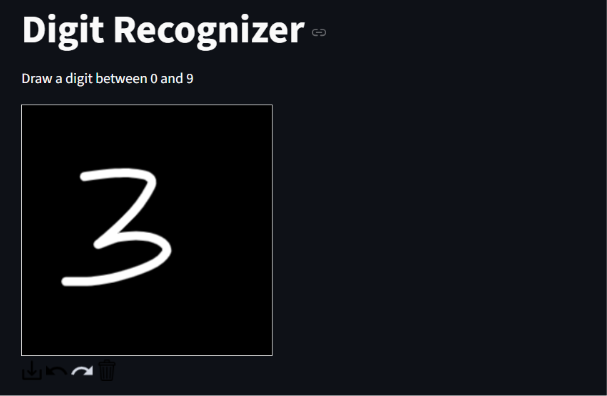
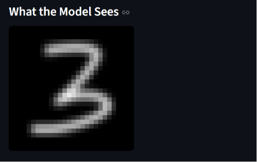
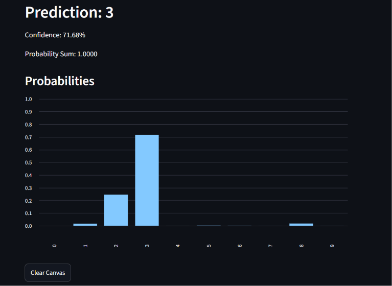
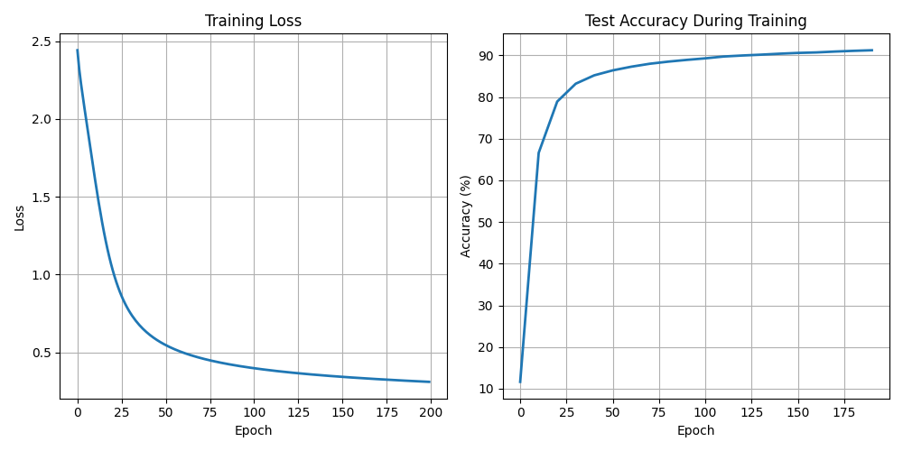

# Neural Network from Scratch for Handwritten Digit Recognition

NN implemeted from scratch using **NumPy** to classify handwritten digits from the **MNIST** dataset.

No deep learning frameworks such as PyTorch or TensorFlow were used for model training. Every component, including forward propagation, backpropagation, loss computation, and gradient descent, was implemented manually.

also includes **Streamlit web application** where users can draw digits on a canvas and receive real-time predictions from the trained model.

---

## Features

- Neural Network implemented from scratch
- Vectorized NumPy implementation
- ReLU activation
- Softmax output layer
- Cross Entropy Loss
- Backpropagation from scratch
- He Weight Initialization
- Full Batch Gradient Descent
- Model saving and loading
- Training loss and accuracy (during training) visualization
- Streamlit UI for real-time digit recognition
- Custom canvas preprocessing pipeline

---

## Project Demo

### Draw a digit


### Model preprocessing


### Prediction


---

## Training Configuration

| Parameter | Value |
|-----------|--------|
| Dataset | MNIST |
| Input Size | 784 |
| Hidden Layer 1 | 128 (ReLU) |
| Hidden Layer 2 | 64 (ReLU) |
| Output Layer | 10 (Softmax) |
| Activation | ReLU |
| Output Activation | Softmax |
| Loss Function | Cross Entropy |
| Weight Initialization | He Initialization |
| Optimizer | Gradient Descent |
| Learning Rate | 0.1 |
| Epochs | 200 |

---

## Training Pipeline

```text
Load MNIST
      |
      v
Flatten Images
      |
      v
Normalize Pixels
      |
      v
One Hot Encode Labels
      |
      v
Initialize Parameters
      |
      v
Forward Propagation
      |
      v
Compute Cross Entropy Loss
      |
      v
Backpropagation
      |
      v
Gradient Descent
      |
      v
Update Parameters
      |
      v
Repeat
      |
      v
Evaluate on Test Set
      |
      v
Save Model
```

---

## Results

#### Final Test Accuracy

**91.41%**

#### Training Curve



---


## Streamlit Inference Pipeline

```
User Draws Digit -> Capture Canvas -> Convert to Grayscale -> Threshold Image -> Find Bounding Box -> Crop Digit -> Resize while Preserving Aspect Ratio -> Center in 28x28 Canvas -> Normalize -> Forward Propagation -> Predict Digit
```

---

